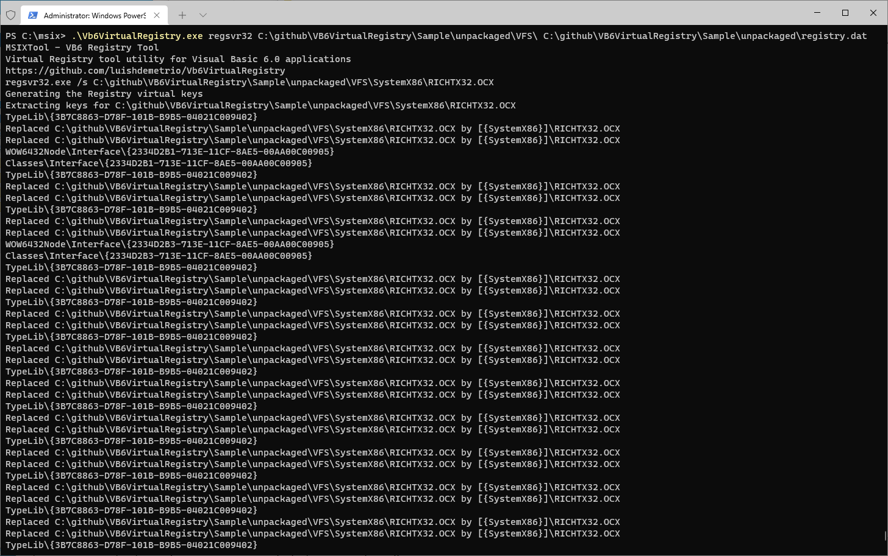

[](https://github.com/luishdemetrio/Vb6VirtualRegistry/actions/workflows/dotnet.yml)

# VB6 Registry Tool


This is a very specific project created to assist developers who want to publish their **Visual Basic 6.0 applications**, which still demand periodic updates/implementations, through the  [MSIX](https://docs.microsoft.com/en-us/windows/msix/overview "What is MSIX?") format.

This project helps to automate the Visual Basic 6.0 packaging by generating a virtual registry file to be added on the **VB6 MSIX** package with the components (OCXs and DLLs) used by the VB6 application.

## Purpose
Some companies still having legacy applications, like Visual Basic 6.0, that still working well and that don't require modifications. Some of them no longer have the source code of those VB6 applications. For this scenario, the [MSIX Packaging Tool](https://docs.microsoft.com/en-us/windows/msix/packaging-tool/tool-overview "MSIX Packaging Tool") is very effective for packaging the VB6 application to the MSIX format which simplifies the installation of those applications **by removing the need for administrative rights for installing or registering components**. 


But there are also companies that still have **applications developed in Visual Basic 6.0 that are often updated**. Unlike other applications, when a VB6 application is modified, in certain situations, the **CLSID of its components can be changed during the new build**. For this specific scenario, due to the amount of builds and deployments, having to manually perform the entire packaging process to ensure that the virtual registry keys are updated is time consuming.

The tool **VB6RegistryTool** creates the virtual registry of the application components through a single command line, allowing to automate and simplify the packaging of VB6 applications for MSIX.

### This project uses the OffregLib project available on GitHub
As the original [OffregLib](https://github.com/LordMike/OffregLib "OffregLib repo on GitHub") project was developed in **.NET Framework 4** at the time when **VB6RegistryTool** was created, I cloned their repository, migrated it to .NET Core 3.1 and included here in this project.

More about the official OffregLib here: http://nuget.org/packages/OffregLib


## Examples 
### How to generate the virtual registry for MSIX package.


#### Demo application.

Let's use the following **VB6 Project1**, that is available in this repo, as an example of a VB6 application.


This project depends on the **RICHTXT32.OCX** and requires that the OCX is registered through **REGSVR32**.


#### Create the package structure.
To package this project to MSIX, it will be necessary to create a folder with the following structure:


The **Assets** folder contains the application images like default tile and logo images.


You can easily generate the images for you application through the [PWA Builder Image Generator](https://www.pwabuilder.com/imagegenerator)


The application and its dependencies can be published in any folder inside the package. It is possible to use the special folder called **VFS**, acronym for Virtual File System, that contains the corresponding folders for the Windows' well-known folders (System32, Program Files, etc). This is great for applications that expects files in the original path outside the package.

For the Project1, the **VFS** contains the folders ProgramFilesX86 and SystemX86.


Follows the content of the ProgramFilesX86 folder:


Because the **myfile.txt** file is inside the special folder **VFS\ProgramFilesX86**, during runtime Windows will redirect the application read attempt from **C:\Program Files (x86)\MyApp\myfile.txt** to the file inside the package. For example, in the next image it is possible to see that the myfile.txt path is hard coded to **C:\Program Files (x86)\MyApp\myfile.txt**.  


During runtime, the app can successfully read the myfile.txt inside the package, even that the path is pointing to **C:\Program Files (x86)\MyApp\myfile.txt**.


The other special package folder is the **VFS\SystemX86** which refers to its native counterpart **C:\Windows\System32**. For this sample, this folder contains the **RICHTX32.OCX** component used by Project1 application.


The last file available in the application package folder is the **AppxManifest.xml** that is the application manifest that contains the elements and attributes that the MSIX application needs.


Here is the application manifest content:

```xml
<?xml version="1.0" encoding="utf-8"?>
<Package xmlns="http://schemas.microsoft.com/appx/manifest/foundation/windows10" 
         xmlns:uap="http://schemas.microsoft.com/appx/manifest/uap/windows10" 
         xmlns:uap10="http://schemas.microsoft.com/appx/manifest/uap/windows10/10" 
         xmlns:rescap="http://schemas.microsoft.com/appx/manifest/foundation/windows10/restrictedcapabilities" 
         xmlns:com="http://schemas.microsoft.com/appx/manifest/com/windows10" 
         IgnorableNamespaces="uap uap10 rescap com">
 
  <Identity Name="VB6Sample" Publisher="CN=Vb6VirtualRegistry" Version="1.0.0.0" ProcessorArchitecture="x86" />
  
  <Properties>
    <DisplayName>VB6 Sample</DisplayName>
    <PublisherDisplayName>AppConsult</PublisherDisplayName>
    <Description>VB6 Sample</Description>
    <Logo>Assets\StoreLogo.png</Logo>
    <uap10:PackageIntegrity>
      <uap10:Content Enforcement="on" />
    </uap10:PackageIntegrity>
  </Properties>
  
  <Resources>
    <Resource Language="en-us" />
  </Resources>
  
  <Dependencies>
    <TargetDeviceFamily Name="Windows.Desktop" MinVersion="10.0.17763.0" MaxVersionTested="10.0.19041.1" />
  </Dependencies>
  <Applications>

    <Application Id="App" Executable="VFS\ProgramFilesX86\MyApp\Project1.exe" 
                          EntryPoint="Windows.FullTrustApplication">
        
      <uap:VisualElements BackgroundColor="transparent" DisplayName="VB6 Sample" 
                          Square150x150Logo="Assets\VBSix-Square150x150Logo.png" 
                          Square44x44Logo="Assets\VBSix-Square44x44Logo.png"
                          Description="VB6 Sample">
          
        <uap:DefaultTile  Wide310x150Logo="Assets\VBSix-Wide310x150Logo.png" 
                          Square310x310Logo="Assets\VBSix-Square310x310Logo.png" 
                          Square71x71Logo="Assets\VBSix-Square71x71Logo.png"/>
      </uap:VisualElements>
      
    </Application>
     </Applications>
  
<Capabilities>
  <rescap:Capability Name="runFullTrust" />
</Capabilities>
</Package>

```

If we try to package and install the Project1 to the MSIX format right now, the application will throw the following an exception during the initialization because the **RICHTX32.OCX is not registered**:


As we want to deploy everything inside the MSIX package (files and registry keys), we need to create the **virtual registry** ([registry.dat](https://docs.microsoft.com/en-us/windows/msix/desktop/desktop-to-uwp-behind-the-scenes) file) which serves as the logical equivalent of HKLM\Software in the real registry. At runtime, this virtual registry merges the contents of this hive into the native system hive to provide a singular view of both.

#### VB6VirtualRegistry.

This is the moment where we can use the **VB6 Virtual Registry tool** to create the virtual registry. The tool will register the component in the physical machine to next export the registry to the virtual registry.dat. As I don't want to have this component registered on my production machine, i.e., to not compromise my tests, since this file will be deployed inside the MSIX package, I will use a VM to run the following command that needs to run elevated (as admin): 

```cmd
Vb6VirtualRegistry.exe regsvr32 c:\github\Vb6VirtualRegistry\Sample\unpackaged\VFS c:\github\Vb6VirtualRegistry\Sample\unpackaged\registry.dat
```

Follows the expected result:



The next step is to copy the file to the package root:


#### Packaging the directory to MSIX

Use the following command to package your directory to MSIX:

```cmd
Vb6VirtualRegistry.exe pack c:\github\Vb6VirtualRegistry\Sample\unpackaged\ c:\github\Vb6VirtualRegistry\Sample\myvb6app.msix
```


#### Using PowerShell to create a self-signed certificate

The following script will load the methods that will be used to create a self-signed certificate:

```PowerShell

# it loads the methods defined on msixFunctions.ps1
. "C:\github\Vb6VirtualRegistry\Scripts\msixFunctions.ps1"

# it creates a self-signed certificate for CN=VB6VirtualRegistry 
# and it installs the certificate on Local Machine \ Trusted People
# notice that the name must be the same defined on the app manifest Publisher="CN=Vb6VirtualRegistry" 
CreateCertificate "Vb6VirtualRegistry" "C:\github\Vb6VirtualRegistry\Scripts\Sample"

```
#### Signing the MSIX file

Use the following command to sign your directory to MSIX:

```cmd
Vb6VirtualRegistry.exe sign c:\github\Vb6VirtualRegistry\Sample\myvb6app.msix C:\github\Vb6VirtualRegistry\Scripts\Sample\VB6VirtualRegistry.pfx
```


Follows the result files:


#### Install the application.

Now we can install our package application by double-clicking on the myvb6app.msix:


Follows the application running as MSIX:


Once we are running as MSIX, we don't need admin privileges to install the application, once the application's components are now inside the virtual registry of the package.


#### Unpack the MSIX file

Use the following command to unpack your MSIX application:

```cmd
Vb6VirtualRegistry.exe unpack c:\github\Vb6VirtualRegistry\Sample\myvb6app.msix C:\github\Vb6VirtualRegistry\Scripts\Sample\unpack
```

Once you have unpacked it, you can now edit the files, images or regenerate the virtual registry.

## Privacy Statement

This application do not collect or use any personal information.

